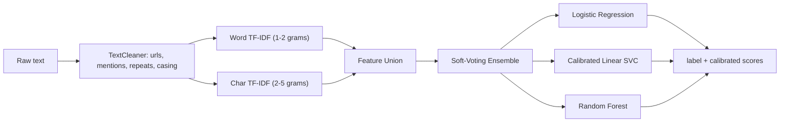

# Hate Speech Detection

> A reproducible, production-shaped text classifier that flags `hate`, `offensive`, and `neither`, built around a calibrated TF-IDF ensemble with an evaluation-first design.

This is a classical-ML text classification system done carefully: word **and** character
n-grams to survive obfuscation, a calibrated soft-voting ensemble, an evaluation harness
that reports macro F1 against an honest majority-class baseline, a FastAPI inference
service, tests, and CI.

## Why this design

Three decisions drive the whole system, each recorded as an ADR in `docs/decisions/`:

1. **Word + character n-grams.** Abusive text is adversarial. Users misspell and obfuscate (`h@te`, `stoopid`, `id10t`), and word features miss it. Character n-grams (`char_wb`, 2-5) catch sub-word patterns that survive obfuscation and generalize across spelling variation. ([ADR-0001](docs/decisions/0001-char-and-word-ngrams.md))
2. **Calibrated soft-voting ensemble.** Logistic regression and a linear SVC are strong on sparse TF-IDF; a random forest adds non-linear signal. LinearSVC is wrapped in `CalibratedClassifierCV` so it can contribute calibrated probabilities to soft voting and to confidence scores at serving time. ([ADR-0002](docs/decisions/0002-soft-voting-ensemble.md))
3. **Evaluation is part of the system.** Macro F1 is the headline metric (not accuracy, which is misleading on imbalanced data), reported next to a majority-class baseline so the lift is honest. Every training run writes `metrics.json`, a per-class report, and a confusion matrix.

## Architecture



The cleaning, vectorization, and model live in a single scikit-learn `Pipeline`, so the
exact same transform runs at train and inference time. No training/serving skew.

## Project structure

```
hate-speech-detection/
├── src/hsd/
│   ├── config.py        env/YAML-driven typed config (pydantic)
│   ├── data.py          load + stratified split
│   ├── preprocess.py    TextCleaner transformer
│   ├── models.py        feature union + calibrated voting pipeline
│   ├── train.py         CV, fit, evaluate, save artifacts
│   ├── evaluate.py      metrics, per-class report, confusion matrix
│   ├── predict.py       load model + classify (CLI)
│   └── api.py           FastAPI inference service
├── config/              config.yaml (full) + sample.yaml (smoke test)
├── scripts/             prepare_davidson.py
├── tests/               pytest unit + pipeline smoke tests
├── docs/                MODEL_CARD.md + Architecture Decision Records
├── data/                sample.csv + how to fetch the real dataset
├── Dockerfile           containerized API
└── .github/workflows/   CI on Python 3.10-3.12
```

## Quick start

```bash
git clone https://github.com/Parths8104/hate-speech-detection.git
cd hate-speech-detection
python -m venv .venv && source .venv/bin/activate   # Windows: .venv\Scripts\activate
pip install -e ".[dev]"
```

Smoke-test the whole pipeline on the bundled synthetic sample in seconds:

```bash
python -m hsd.train --config config/sample.yaml
```

Train on real data (see [data/README.md](data/README.md) to fetch the Davidson dataset):

```bash
python scripts/prepare_davidson.py --in labeled_data.csv --out data/dataset.csv
python -m hsd.train --config config/config.yaml
```

Classify text:

```bash
python -m hsd.predict "you are a clueless fool"
# label      : offensive
# confidence : 0.83
# scores     : offensive 0.83 / neither 0.11 / hate 0.06
```

Serve it as an API:

```bash
uvicorn hsd.api:app --reload
# POST /predict {"text": "..."}  ·  interactive docs at /docs
```

## Results

Training writes `models/metrics.json`, a per-class `classification_report.json`, and a
row-normalized confusion matrix to `models/reports/`. Metrics are reported as **macro F1
with a majority-class baseline** for an honest read of the lift:

```json
{
  "accuracy": "...",
  "f1_macro": "...",
  "f1_weighted": "...",
  "baseline_majority_f1_macro": "...",
  "lift_over_baseline_f1_macro": "...",
  "cv_f1_macro_mean": "...",
  "cv_f1_macro_std": "..."
}
```

> Reproduce the numbers with `python -m hsd.train` and report what your run produces.
> The values depend on the dataset and split, so this README does not hardcode them.

## Testing and CI

```bash
pytest -q          # unit tests for preprocessing + an end-to-end pipeline smoke test
ruff check src tests
```

CI runs lint and the test suite on Python 3.10, 3.11, and 3.12 via GitHub Actions.

## Responsible use

Hate speech classification is high-stakes and error-prone, and naive deployment can
produce biased outcomes. This model is built as a **triage aid for human reviewers**, not
an automated decision-maker. See [docs/MODEL_CARD.md](docs/MODEL_CARD.md) for intended
use, known limitations (including documented dialectal bias on this dataset), and ethical
considerations.

## License

MIT
